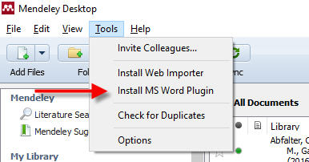
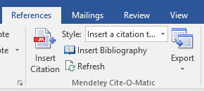
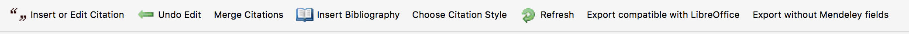
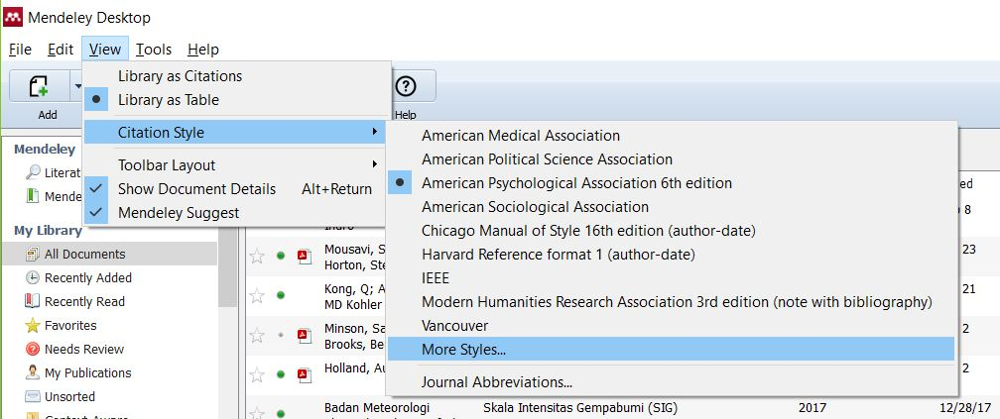
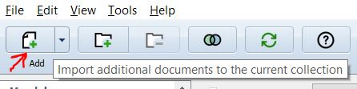
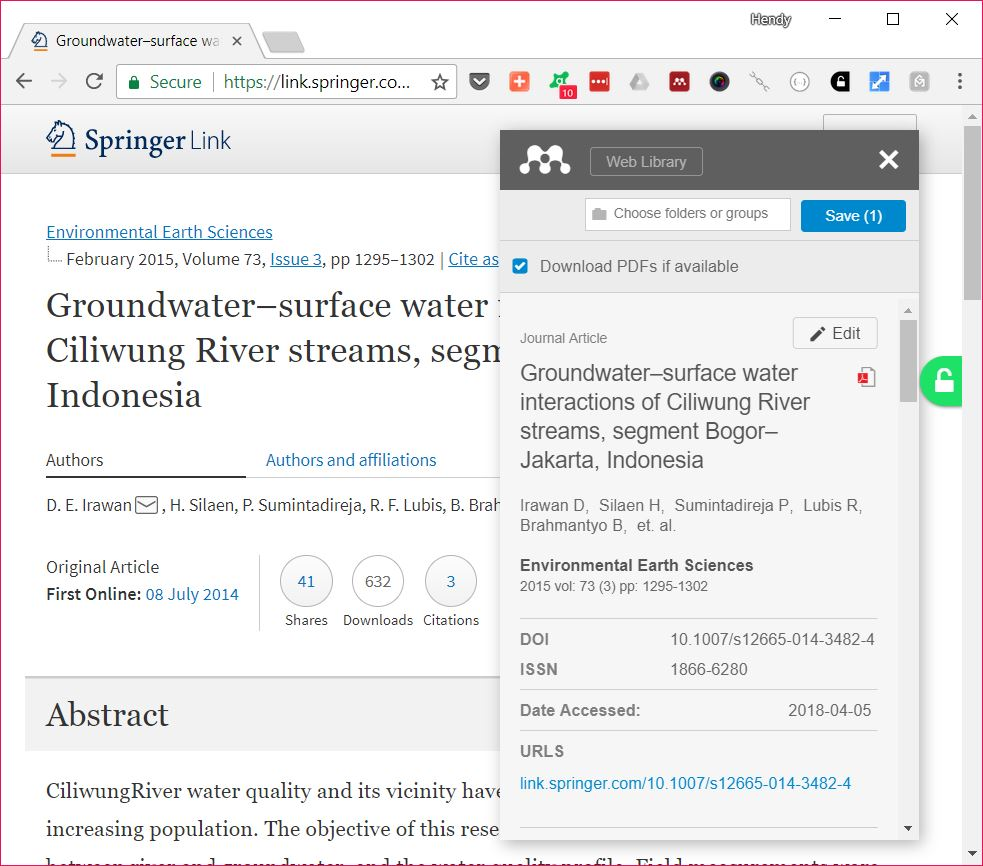
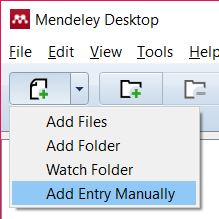
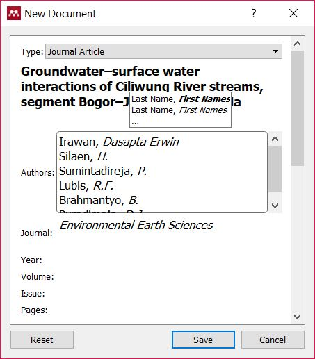
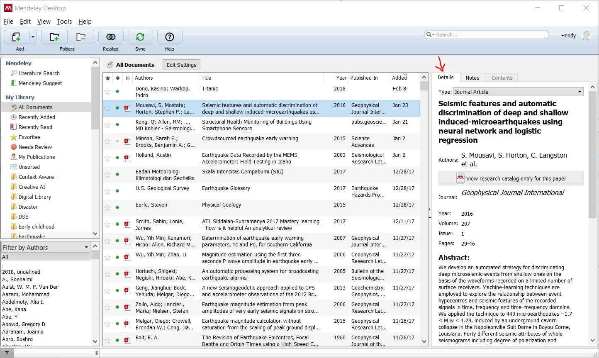
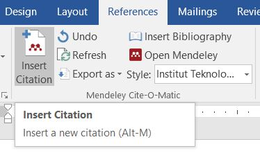

# Documentation for SPs ITB Citation Style Language (CSL)

Sekolah Pascasarjana (SPs) ITB provides a Citation Style Language (CSL) which can be used in supported reference manager software, to format references and bibliography in conformance with [SPs ITB guidelines for master's thesis and doctoral dissertation](http://www.sps.itb.ac.id/in/pedoman-tesis-dan-disertasi/).

SPS ITB provides tutorial to use the CSL with the following software:

* Microsoft Word 2010/2013/2016 and Mendeley, for Windows and macOS

As CSL is an open and widely supported format, it is also usable in other software, e.g. LibreOffice, Zotero, and Linux-based operating systems. Please refer to your reference manager's documentation on how to use this CSL in your preferred software, or you can [contribute to this documentation by submitting a GitHub pull request](https://github.com/itb-sps/csl).

## Using This CSL with Microsoft Word 2010/2013/2016 and Mendeley

### Preparation

1. Make sure you have installed **Microsoft Office 2010/2013/2016**.

2. Download and install **Mendeley** from https://mendeley.com/

3. Run Mendeley.

4. Sign-up or login to your Mendeley account so you can save and sync all your references easily.

5. Click **Tools > Install MS Word Plugin**. Follow the instructions.

   

6. Ensure you can see Mendeley in Microsoft Word.

   For Windows in **References tab**:

   

   For macOS in **Add-ins tab**:

   

7. TODO - instructions for final version: (**DO NOT USE THIS ONE, SKIP TO NEXT STEP**)

   a. In Mendeley, click **View > Citation Style > More Styles...**

      

   b. Click **Get More Styles** tab.

   c. Search for "institut teknologi bandung"

   d. Click **Install**

   e. Go to **Installed** tab.

   f. Select **Institut Teknologi Bandung - SPs** then click **Use this Style**.

   g. In **Citation and Bibliography Language**, select **Indonesian** or **English** based on the language of your thesis/dissertation.

8. TODO - instructions for development version: 

   a. Download the CSL file: [institut-teknologi-bandung-sps.csl](https://raw.githubusercontent.com/ceefour/styles/itb-sps/institut-teknologi-bandung-sps.csl).

   b. In Mendeley, click **View > Citation Style > More Styles...**

      

   c. Drag and drop `institut-teknologi-bandung-sps.csl` from File Explorer to Mendeley Citation Styles window.

   d. Select **Institut Teknologi Bandung - SPs** then click **Use this Style**.

   e. In **Citation and Bibliography Language**, select **Indonesian** or **English** based on the language of your thesis/dissertation.

9. Congratulations! Now you are ready to collect documents, insert citations, and insert a bibliography in your documents.

### Collect Documents

Before you can insert a citation, you need to collect documents first in Mendeley. There are many ways to collect documents, for example:

1. By adding a paper's PDF file

2. Using the Web Importer plugin (recommended)

3. Adding manually (as a last resort)

#### Collect Documents from PDF files

If you already have PDF files of the papers you want to add, click the **Add** button in the toolbar, then select the PDF files.

_Tip_: You can also drag-and-drop PDF files to the Mendeley Desktop window.

#### Collect Documents using the Web Importer plugin (recommended)

The Web Importer is the most convenient way to add documents, it will even download the PDF file for you if available.

1. [Install the Web Importer plugin](https://www.mendeley.com/reference-management/web-importer) for your favorite browser.

2. After the Web Importer plugin is installed, login to your Mendeley account.

3. Visit Google Search, IEEE Xplore, or your favorite journal/proceeding web site. When you want to import the document(s) that you are viewing, click the **Import to Mendeley** button in your browser.

   

   Click **Save**.

4. After you have finished importing documents from the web: Open **Mendeley Desktop app**, click **Sync** button.

   Your imported documents will show up after sync is complete.

#### Collect Documents Manually

Sometimes the quick and easy methods do not work, or you just want to add documents manually.

1. In Mendeley Desktop, click **Add > Add Entry Manually...**.

   

2. Input the document details.

   

3. Click **Save**.

#### Edit/Correct Document Details

Mendeley will automatically try to fill the document details, but there are cases when this information is not accurate. You can edit or correct this using the **Details** sidebar.

### Inserting Citations

1. Create a Word document for your thesis or dissertation, preferably using the [template provided by SPs ITB](http://www.sps.itb.ac.id/in/pedoman-tesis-dan-disertasi/).

2. In the place where you want to put the citation, click **References > Insert Citation**.

   Type the keywords of your document (author, title, year, etc.) then double-click it or press Enter.

   

### Inserting Bibliography

In the place where you want to put the bibliography, click **References > Insert Bibliography**.

The bibliography will be inserted using syntax according to SPs ITB guidelines.

However, you will still need to ensure correct formatting of:

* font and font size
* paragraph justification

## Feedback

If you have feedback and suggestions about this CSL and/or its documentation, please [post an issue here](https://github.com/itb-sps/csl/issues).
