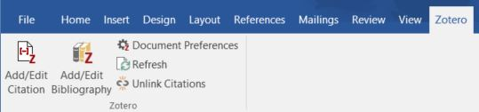
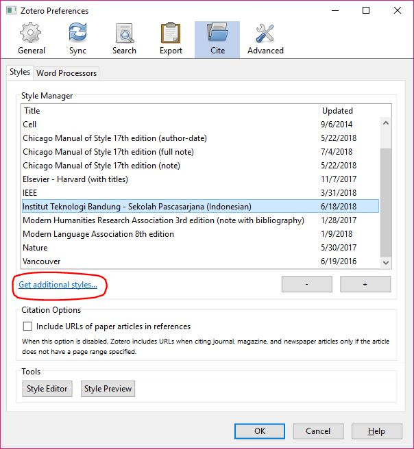
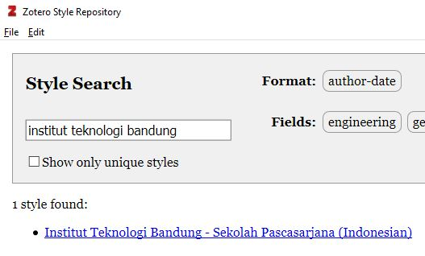
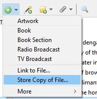
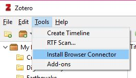
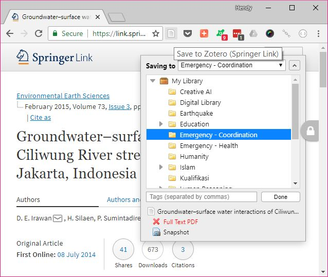
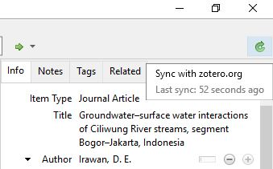
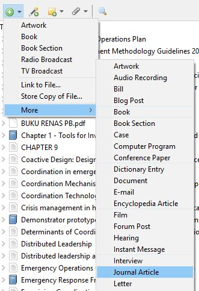
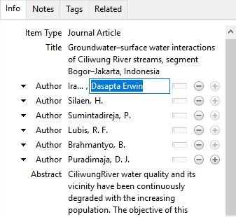

# SPs ITB Citation Style Language (CSL) Guide

[**English guide**](./) - [**Indonesian translation**](./id)

Sekolah Pascasarjana (SPs) ITB provides a Citation Style Language (CSL) which can be used in supported reference manager software, to format references and bibliography in conformance with [SPs ITB guidelines for master's thesis and doctoral dissertation](http://www.sps.itb.ac.id/in/pedoman-tesis-dan-disertasi/).

SPS ITB provides tutorial to use the CSL with the following software:

* [Microsoft Word 2010/2013/2016](https://products.office.com/en/word) and [Zotero](https://www.zotero.org/), for Windows and macOS

As CSL is an open and widely supported format, it is also usable in other software, e.g. [LibreOffice](http://libreoffice.org), [Mendeley](https://mendeley.com/), and Linux-based operating systems like [Ubuntu](https://ubuntu.com/) and [Linux Mint](https://linuxmint.com/). Please refer to your reference manager's documentation on how to use this CSL in your preferred software, or you can [contribute to this documentation by submitting a GitHub pull request](https://github.com/itb-sps/csl).

## Preparation

1. Make sure you have installed **Microsoft Office 2010/2013/2016**.

2. Download and install **Zotero** from [https://www.zotero.org/](www.zotero.org)

3. Run Zotero.

4. Sign-up or login to your Zotero account so you can save and sync all your references easily.

6. Ensure you can see Zotero in Microsoft Word's Zotero ribbon tab.

   

7. Install **Institut Teknologi Bandung - Sekolah Pascasarjana** style, as follows:

   a. In Zotero, click **Edit > Preferences...**

   b. Click **Get additional styles...**.

      

   c. Search for "**institut teknologi bandung**"

      

   d. Click **Institut Teknologi Bandung - Sekolah Pascasarjana**

   e. Click **OK**.

8. Congratulations! Now you are ready to collect documents, insert citations, and insert a bibliography in your documents.

## Collect Documents

Before you can insert a citation, you need to collect documents first in Zotero. Although there are many ways to collect documents, this guide will describe the most common ones:

1. By adding a paper's PDF file

2. Using the Browser Connector add-on (recommended)

3. Adding manually (as a last resort)

### Collect Documents from PDF files

If you already have PDF files of the papers you want to add, simply drag-and-drop PDF files to the Zotero app.

Alternatively, you can also click **Add > Store Copy of File...**

### Collect Documents using the Browser Connector add-on (recommended)

The Browser Connector add-on is the most convenient way to add documents, it will even download the PDF file for you if available.

1. [Install Zotero Browser Connector](https://www.zotero.org/download/) for your favorite browser.

   

2. After the Browser Connector add-on is installed, login to your [Zotero.org](https://www.zotero.org/) account.

3. Visit Google Search, IEEE Xplore, or your favorite journal/proceeding web site. When you want to import the document(s) that you are viewing, click the **Save to Zotero** button in your browser.

   

   Click **Save**.

4. After you have finished importing documents from the web: Open **Zotero app**, click **Sync with zotero.org** button so that you can immediately use these documents.

   Your imported documents will show up in **Zotero app** after sync is complete.

   

### Collect Documents Manually

Sometimes the quick and easy methods do not work, or you just want to add documents manually.

1. In Zotero app, click **Add > (document type)**. Commonly used types are **Conference Proceeding** and **Journal Article**.

   

2. In the **Info pane**, enter the document details.

   

Refer to the later section **Document Types and Supported Fields** for more information on how to choose document type and fill these fields correctly.

## Inserting Citations

1. Create a Word document for your thesis or dissertation, using the [template provided by SPs ITB](http://www.sps.itb.ac.id/in/pedoman-tesis-dan-disertasi/).

2. In **Zotero** ribbon tab, click **Document Preferences**.

   a. In **Citation Style**, choose **Institut Teknologi Bandung - Sekolah Pascasarjana**.
   b. In **Language**, select **Bahasa Indonesia** or **English** based on the language of your thesis/dissertation.

3. In the place where you want to put the citation, click **Zotero > Add/Edit Citation**.

   Type the keywords of your document (author, title, year, etc.) then double-click it or press Enter.

## Inserting Bibliography

In the place where you want to put the bibliography, click **Zotero > Add/Edit Bibliography**.

The bibliography will be inserted using syntax according to SPs ITB guidelines.

**Important:** you will still need to ensure correct formatting according to [Pedoman Tesis dan Disertasi SPs ITB](http://www.sps.itb.ac.id/in/pedoman-tesis-dan-disertasi/), because the following are not controlled by CSL:

* font and font size
* paragraph justification

## More about Zotero

Zotero has **a lot** of useful features. This tutorial only covers the basic usage.

Check out [Zotero Documentation](https://www.zotero.org/support/) for more information.

## Document Types and Supported Fields

Zotero will automatically try to fill the document details, but there are cases when this information is not accurate. You can edit or correct this using the **Info pane**.

Below you will find all document types and fields supported by this CSL, and how to use them.

### 1. Book

| Field      | Required? | Example                         |
|------------|-----------|---------------------------------|
| Title      | Required  | Principles of measurement system |
| Author(s)  | Required  | Bentley, John P.                |
| Editor(s)  | Optional  |                                 |
| Date       | Required  | 1995                            |
| Place      | Required  | New York, NY                    |
| Publisher  | Required  | John Wiley & Sons               |
| # of Pages | Optional  |                                 |
| Edition    | Optional  | 3rd                             |
| Volume     | Optional  |                                 |

Example bibliography:

Bentley, J. P. (1995): _Principles of measurement system_ (3rd ed.), New York, NY, John Wiley & Sons.

### 2. Book Section

| Field      | Required? | Example                         |
|------------|-----------|---------------------------------|
| Title      | Required  | Validation of instrument measuring continuous variable in medicine |
| Author(s)  | Required  | Zaki, Rafdzah                   |
| Editor(s)  | Optional  | Hokimoto, Tsukasa               |
| Book Title | Required  | Advances in statistical methodologies and their application to real problems |
| Date       | Required  | 2017                            |
| Place      | Required  | London                          |
| Publisher  | Required  | IntechOpen                      |
| Pages      | Optional  | 217-237                         |
| Edition    | Optional  |                                 |
| Volume     | Optional  |                                 |

Example bibliography:

Zaki, R. (2017): Validation of instrument measuring continuous variable in medicine, _dalam_ T. Hokimoto, ed., _Advances in statistical methodologies and their application to real problems_, London, IntechOpen, 217–237.

### 3. E-book (item type: Book)

| Field      | Required? | Example                         |
|------------|-----------|---------------------------------|
| Title      | Required  | Medical instrumentation: application and design |
| Author(s)  | Required  | Webster, John G.                |
| Editor(s)  | Optional  |                                 |
| Date       | Required  | 2009                            |
| URL        | Required  | https://books.google.co.id/     |
| Place      | Optional  |                                 |
| Publisher  | Optional  |                                 |
| # of Pages | Optional  |                                 |
| Edition    | Optional  | 4th                             |
| Volume     | Optional  |                                 |

### 4. Journal Article

| Field       | Required?   | Example                         |
|-------------|-------------|---------------------------------|
| Title       | Required    | Scanning X-ray microscopy with large solid angle X-ray fluorescence detection at the XUV beamline P04, DESY |
| Author(s)   | Required    | Andrianov, K.                   |
|             |             | Haidl, A.                       |
|             |             | Lühl, L.                        |
|             |             | Dehlinger, A.                   |
|             |             | Dierks, H.                      |
|             |             | Gnewkow, R.                     |
|             |             | Nisius, T.                      |
|             |             | Kanngießer, B.                  |
|             |             | Wilhein, T.                     |
| Publication | Required    | Journal of Instrumentation      |
| Volume      | Optional    | 13                              |
| Issue       | Optional    |                                 |
| Pages       | Optional    |                                 |
| Date        | Required    | 2008                            |
| DOI         | Recommended | 10.1088/1742-6596/849/1/012007  |
| URL         | Optional    | http://iopscience.iop.org/1742-6596/849/1/012007/ |

Example bibliography:

Andrianov, K., Haidl, A., Lühl, L., Dehlinger, A., Dierks, H., Gnewkow, R., Nisius, T., Kanngießer, B., dan Wilhein, T. (2018): Scanning X-ray microscopy with large solid angle X-ray fluorescence detection at the XUV beamline P04, DESY, _Journal of Instrumentation_, **13**. https://doi.org/10.1088/1742-6596/849/1/012007

### 4. Conference Paper

| Field       | Required?   | Example                         |
|-------------|-------------|---------------------------------|
| Title       | Required    | Review of computer assisted diagnosis to analyze the MRI (Magnetic Resource Image) and detect Alzheimer disease |
| Author(s)   | Required    | Rabeh, Amira Ben                |
|             |             | Benzarti, Faouzi                |
|             |             | Amiri, Hamid                    |
| Proceedings Title | Required    | 2017 14th International Conference on Computer Graphics, Imaging and Visualization      |
| Publisher   | Required    | IEEE                            |
| Volume      | Optional    |                                 |
| Pages       | Optional    | 117-121                         |
| Date        | Required    | 2017-05                         |
| DOI         | Recommended | 10.1109/CGiV.2017.21            |
| URL         | Optional    | https://ieeexplore.ieee.org/document/8361554/ |

Example bibliography:

Rabeh, A. B., Benzarti, F., dan Amiri, H. (2017): Review of computer assisted diagnosis to analyze the MRI (Magnetic Resource Image) and detect Alzheimer disease, _2017 14th International Conference on Computer Graphics, Imaging and Visualization_, IEEE, 117–121. https://doi.org/10.1109/CGiV.2017.21

### 5. Webpage (item type: Document)

| Field       | Required?   | Example                         |
|-------------|-------------|---------------------------------|
| Title       | Required    | Ultrasonic Detection – Basics & Application |
| Author(s)   | Required    | Agarwal, Tarun                  |
| Proceedings Title | Required    | 2017 14th International Conference on Computer Graphics, Imaging and Visualization      |
| Publisher   | Optional    |                                 |
| Date        | Required    | 2015                            |
| URL         | Required    | https://www.elprocus.com/ultrasonic-detection-basics-application/ |

Example bibliography:

Agarwal, T. (2015): Ultrasonic Detection – Basics & Application, diperoleh melalui situs internet: https://www.elprocus.com/ultrasonic-detection-basics-application/.

### 6. Patent

| Field             | Required?   | Example                          |
|-------------------|-------------|----------------------------------|
| Patent Number     | Required    | U.S. Patent No. 6,606,963        |
| Title             | Optional    |                                  |
| Inventor(s)       | Required    | Wynne, B. M.                     |
| Place             | Required    | Washington, DC                   |
| Issuing Authority | Required    | U.S. Patent and Trademark Office |
| Issue Date        | Required    | 2003                             |
| URL               | Optional    | https://patents.google.com/patent/US6606963B1/en |

Example bibliography:

Wynne, B. M. (2003): _U.S. Patent No. 6,606,963_, Washington, DC, U.S. Patent and Trademark Office. 

### 7. Thesis (including Dissertation)

| Field             | Required?   | Example                          |
|-------------------|-------------|----------------------------------|
| Title             | Required    | Analisis citra radiografi panoramik pada condilus mandibula untuk deteksi dini osteoporosis |
| Author(s)         | Required    | Mayantasari, Menasita            |
| Place             | Optional    |                                  |
| Type              | Optional    | Disertasi Program Doktor         |
| University        | Required    | Institut Teknologi Bandung       |
| Date              | Required    | 2011                             |
| URL               | Optional    |                                  |

Example bibliography:

Mayantasari, M. (2011): _Analisis citra radiografi panoramik pada condilus mandibula untuk deteksi dini osteoporosis_ (Disertasi Program Doktor), Institut Teknologi Bandung.

### 8. Report

| Field             | Required?   | Example                          |
|-------------------|-------------|----------------------------------|
| Title             | Required    | Kajian potensi mineral ikutan pada pertambangan timah   |
| Author(s)         | Required    | Pusat Data dan Teknologi Informasi Sumber Daya Energi dan Mineral Kementerian Energi dan Sumber Daya Mineral |
| Date              | Required    | 2017                             |
| Pages             | Optional    |                                  |
| URL               | Optional    |                                  |

### 9. Standard (item type: Report)

| Field             | Required?   | Example                          |
|-------------------|-------------|----------------------------------|
| Title             | Required    | Recommended practice for analysis, design, installation, and testing of basic surface safety systems for offshore production platforms (API RP 14C) |
| Author(s)         | Optional    | American Petroleum Institute     |
| Place             | Optional    | Washington                       |
| Institution       | Required    | API Publishing Service           |
| Date              | Required    | 2001                             |
| URL               | Optional    |                                  |

Example bibliography:

* Ij, P. (10 Juni 2010): Demokrasi di era otonomi daerah, _Kompas_, hal. 6.
* Pengelolaan diusulkan satu lembaga. (16 Oktober 2015): _Kompas_, hal. 14.

### 10. Magazine Article

| Field             | Required?   | Example                          |
|-------------------|-------------|----------------------------------|
| Title             | Required    | Pembakaran hutan di Kalimantan   |
| Author(s)         | Required    | Baker, A. A.                     |
|                   |             | Sosro, K.                        |
|                   |             | Suditomo, B.                     |
| Publication       | Required    | Majalah Kehutanan                |
| Volume            | Optional    | 5                                |
| Issue             | Optional    | 5                                |
| Date              | Required    | 1998-05                          |
| Pages             | Optional    | 23-25                            |
| URL               | Optional    |                                  |

Example bibliography:

Baker, A. A., Sosro, K., dan Suditomo, B. (Mei 1998): Pembakaran hutan di Kalimantan, _Majalah Kehutanan_, **5**, 23–25.

### 11. Newspaper Article

| Field             | Required?   | Example                          |
|-------------------|-------------|----------------------------------|
| Title             | Required    | Demokrasi di era otonomi daerah  |
| Author(s)         | Optional    | Ij, Piliang                      |
| Publication       | Required    | Kompas                           |
| Date              | Required    | 2010-06                          |
| Pages             | Optional    | 6                                |
| URL               | Optional    |                                  |

Example bibliography:

* Ij, P. (10 Juni 2010): Demokrasi di era otonomi daerah, _Kompas_, hal. 6.
* Pengelolaan diusulkan satu lembaga. (16 Oktober 2015): _Kompas_, hal. 14.

### 12. Radio Broadcast and TV Broadcast

| Field       | Required?   | Example                         |
|-------------|-------------|---------------------------------|
| Title       | Required    | Arkangel                        |
| Director(s) | Required    | Foster, J.                     |
| Program Title | Required    | Black Mirror       |
| Episode Number | Optional    |                            |
| Place       | Required    | United Kingdom                  |
| Network     | Required    | Netflix                         |
| Date        | Required    | 2016                            |
| URL         | Optional    |                                 |

Example bibliography:

Foster, J. (Sutradara). (2016): Arkangel, _dalam_ Black Mirror, United Kingdom, Netflix.

This CSL does not yet support Scriptwriter and Producer fields. If you need to add them, please type manually in the bibliography.

### 13. Internet Movie Clip (item type: TV Broadcast)

| Field       | Required?   | Example                         |
|-------------|-------------|---------------------------------|
| Title       | Required    | Matchalatte                     |
| Director(s) | Required    | Maychaelson, R.                 |
| Program Title | Optional    |                               |
| Episode Number | Optional    |                              |
| Date        | Required    | 2018                            |
| URL         | Required    | https://www.youtube.com/watch?v=Mb8aeRuAJZw |

This CSL does not yet support Scriptwriter and Producer fields. If you need to add them, please type manually in the bibliography.

### 14. Film

| Field       | Required?   | Example                         |
|-------------|-------------|---------------------------------|
| Title       | Required    | Kartini                         |
| Director(s) | Required    | Bramantyo, Hanung               |
| Distributor | Required    | Indonesia, Legacy Picture dan Screenplay Films |
| Date        | Required    | 2017                            |
| URL         | Required    | https://www.youtube.com/watch?v=Mb8aeRuAJZw |

Example bibliography:

Bramantyo, H. (Sutradara). (2017): _Kartini_, Indonesia, Legacy Picture dan Screenplay Films.

This CSL does not yet support Scriptwriter and Producer fields. If you need to add them, please type manually in the bibliography.

### 15. Artwork (i.e. photo)

| Field       | Required?   | Example                         |
|-------------|-------------|---------------------------------|
| Title       | Required    | The eyes have it                |
| Author(s)   | Required    | Krivic, M.                      |
| Date        | Required    | 2018                            |
| Archive     | Required    | Timbuktu, National Geographic   |
| URL         | Optional    |                                 |

Example bibliography:

Krivic, M. (2018): _The eyes have it_, Timbuktu, National Geographic.

### 16. Personal Communication (including e-mail)

This reference type is not supported by this CSL.

You will need to type them manually:

* Inline citation: (Robbins, 2001)
* Bibliography (Indonesian): E. Robbins, komunikasi pribadi (4 Januari 2001).
* Bibliography (English): E. Robbins, personal communication (January 4, 2001).

## Feedback

If you have feedback and suggestions about this CSL and/or its documentation, please [post an issue here](https://github.com/itb-sps/csl/issues) or email [hendy@hendyirawan.com](mailto:hendy@hendyirawan.com).
